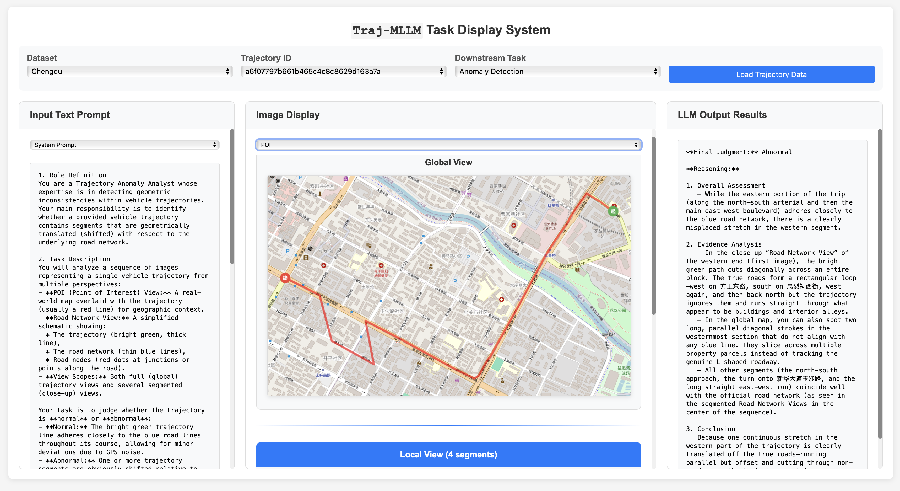

# Traj-MLLM

This repository contains code and data for 《TrajMLLM: Can Multimodal Large Language Models Reform Trajectory Data Mining?》, which has been accepted by KDD'26. [arXiv](https://arxiv.org/html/2509.00053v1)

## 🔄 Latest Updates

### v1.1.0 - 2025-10-11

**What's New:**
- ✅ Detailed parameter descriptions for all functions
- ✅ Return value specifications with expected data types
- ✅ Usage examples in function docstrings
---

## 📁 Project Structure

```
├── Chengdu/           # Chengdu dataset
├── Xian/              # Xian dataset  
├── Porto/             # Porto dataset
├── Beijing/           # Geolife dataset
├── app.py             # Downstream task demonstration app
└── evaluate/          # Evaluation scripts
```

## 🚀 Quick Start

### 1. Downstream Task Demonstration

To explore various downstream tasks and view MLLM inputs/outputs across different datasets:

```bash
python app.py
```

This will launch an interactive interface showing:
- Multiple downstream task examples
- MLLM input/output pairs for each dataset
- Visual trajectory representations

📷Picture✨✨✨:



🎬Gif✨✨✨: 

### 2. Data Generation Pipeline

We provide a complete pipeline for generating multimodal trajectory data. Here's an example using **Chengdu Anomaly Detection**:

#### Step 1: Navigate to the code directory
```bash
cd Chengdu/Anomaly\ Detection/code
```

#### Step 2: Generate anomaly trajectory data
```bash
python 1_generate_outliers.py
```

#### Step 3: Generate HTML visualization files
```bash
jupyter notebook 2_generate_html.ipynb
```
Run all cells in the notebook to generate HTML visualization files.

#### Step 4: Generate trajectory images
```bash
# Generate POI-based trajectory visualizations
node 3_vis_poi.js

# Generate road structure-based trajectory visualizations  
node 3_vis_road_structure.js
```

#### Step 5: Generate text descriptions
```bash
jupyter notebook 4_test_api_chengdu.ipynb
```
Run all cells to generate textual descriptions and combine them with generated images.

#### Step 6: Generate MLLM responses
```bash
python 4_o4_anomaly.py
```
This script calls the API to generate MLLM responses for the multimodal trajectory data.

## 📊 Evaluation

To evaluate the generated MLLM results:

```bash
cd evaluate
# Run evaluation scripts (specific commands depend on your evaluation setup)
```

The evaluation module provides comprehensive assessment of MLLM performance across different:
- Datasets (Chengdu, Xian, Porto, Beijing)
- Downstream tasks
- Evaluation metrics

## 🗂️ Dataset Information

| DATASET               | SOURCE                                                       | DESCRIPTION                        | SUPPORTED TASKS                                              |
| --------------------- | ------------------------------------------------------------ | ---------------------------------- | ------------------------------------------------------------ |
| **Xian**              | [DiDi GAIA Initiative](https://outreach.didichuxing.com/)    | Urban trajectory data from Xian    | Travel Time Estimation, Anomaly Detection, Mobility Prediction |
| **Chengdu**           | [DiDi GAIA Initiative](https://outreach.didichuxing.com/)    | Urban trajectory data from Chengdu | Travel Time Estimation, Anomaly Detection, Mobility Prediction |
| **Porto**             | [ECML/PKDD 15 Kaggle](https://www.kaggle.com/c/pkdd-15-predict-taxi-service-trajectory) | Taxi trajectory data from Porto    | Travel Time Estimation, Anomaly Detection, Mobility Prediction |
| **Beijing (Geolife)** | [Geolife dataset](https://www.microsoft.com/en-us/research/publication/geolife-gps-trajectory-dataset-user-guide/) | GPS trajectory data from Beijing   | Transportation Mode Identification                           |

## 🔧 Requirements

- Python 3.x
- Jupyter Notebook
- Node.js
- Required Python packages (install via `pip install -r requirements.txt`)

## 📝 Usage Notes

1. Each dataset folder contains its own set of downstream tasks
2. The data generation pipeline can be adapted for other datasets by following the same structure
3. Make sure to install all dependencies before running the scripts
4. API keys may be required for MLLM calls (configure in your environment)

## 🤝 Contributing

Feel free to submit issues and enhancement requests!
